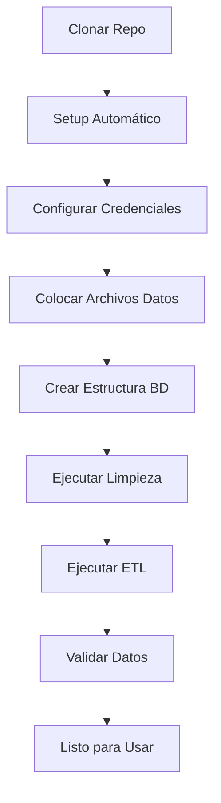
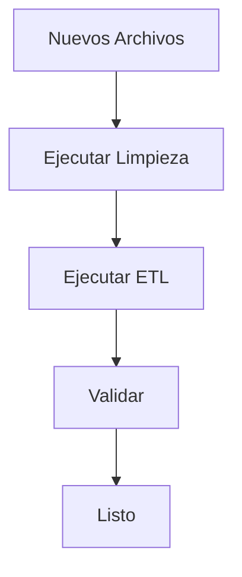

# 📦 Resumen Completo - Data Warehouse Médico

## 🎯 Estado del Proyecto

**✅ LISTO PARA SUBIR A GITHUB**

Todos los archivos están creados, documentados y listos para producción.

---

## 📁 Estructura Final del Proyecto

```
dw-medical-equipment/
│
├── 📄 README.md                          # Documentación principal
├── 📄 QUICK_START.md                     # Guía rápida (5-10 min)
├── 📄 ESTRUCTURA_PROYECTO.md             # Estructura detallada
├── 📄 CONTRIBUTING.md                    # Guía de contribución
├── 📄 LICENSE                            # Licencia MIT
├── 📄 RESUMEN_COMPLETO.md               # Este archivo
├── 📄 .gitignore                         # Archivos ignorados
├── 📄 .env.example                       # Plantilla variables entorno
├── 📄 requirements.txt                   # Dependencias Python
├── 📄 setup.py                           # Setup automático
├── 🔧 run_all.sh                         # Ejecutar todo (Linux/Mac)
├── 🔧 run_all.bat                        # Ejecutar todo (Windows)
├── 🧹 run_cleaning.sh                    # Solo limpieza (Linux/Mac)
├── 🧹 run_cleaning.bat                   # Solo limpieza (Windows)
│
├── 📂 config/
│   ├── database_config.py.example       # Plantilla configuración BD
│   └── database_config.py               # Real (NO subir a Git)
│
├── 📂 sql/
│   ├── 01_create_schemas.sql            # Esquemas
│   ├── 02_create_staging_tables.sql     # Staging
│   ├── 03_create_dimension_tables.sql   # Dimensiones
│   ├── 04_create_fact_tables.sql        # Hechos
│   └── 05_queries_validation.sql        # Validaciones
│
├── 📂 etl/
│   ├── __init__.py
│   ├── etl_dimensions.py                # ETL dimensiones
│   ├── etl_fact_equipos.py             # ETL equipos (TU ORIGINAL)
│   └── etl_fact_servicios.py           # ETL servicios (TU ORIGINAL)
│
├── 📂 data_cleaning/
│   ├── README.md                        # Documentación limpieza
│   ├── clean_reporte_equipos.py        # Limpia reportes
│   ├── clean_insumos_solicitados.py    # Limpia insumos
│   └── clean_pedidos_codificacion.py   # Limpia y codifica pedidos
│
├── 📂 docs/
│   ├── ARCHITECTURE.md                  # Arquitectura sistema
│   ├── DATA_MODEL.md                    # Modelo de datos
│   └── ETL_PROCESS.md                   # Procesos ETL
│
├── 📂 data/                              # NO SUBIR A GIT
│   └── README.md                        # Instrucciones datos
│
└── 📂 logs/                              # NO SUBIR A GIT
    └── .gitkeep
```

---

## 🚀 Inicio Rápido

### Opción 1: Automático (Recomendado)

```bash
# 1. Clonar repositorio
git clone https://github.com/tu-usuario/dw-medical-equipment.git
cd dw-medical-equipment

# 2. Setup automático
python setup.py

# 3. Configurar credenciales
cp config/database_config.py.example config/database_config.py
nano config/database_config.py  # Editar credenciales

# 4. Colocar archivos de datos en data/

# 5. Ejecutar todo
./run_all.sh      # Linux/Mac
run_all.bat       # Windows
```

### Opción 2: Manual

Ver [QUICK_START.md](QUICK_START.md)

---

## 📝 Archivos Que Debes Personalizar

Antes de subir a GitHub o usar en producción:

### 1. README.md
- [ ] Cambiar `tu-usuario` por tu usuario de GitHub
- [ ] Cambiar `tu-email@ejemplo.com` por tu email real
- [ ] Actualizar `Tu Nombre` con tu nombre
- [ ] Agregar badges (opcional)

### 2. config/database_config.py
- [ ] Copiar desde `.example`
- [ ] Configurar credenciales reales
- [ ] **NO subir a GitHub** (está en .gitignore)

### 3. .env
- [ ] Copiar desde `.env.example`
- [ ] Configurar variables
- [ ] **NO subir a GitHub** (está en .gitignore)

### 4. LICENSE
- [ ] Cambiar año y nombre del autor

### 5. CONTRIBUTING.md
- [ ] Actualizar email de contacto
- [ ] Personalizar políticas del proyecto

---

## 🔐 Verificación de Seguridad

Antes de hacer `git push`, verificar:

```bash
# Archivos que NO deben estar staged
git status | grep -E "(database_config.py|\.env$|\.csv|\.xlsx)"

# Si aparecen, eliminarlos:
git rm --cached config/database_config.py
git rm --cached .env
git rm --cached data/*.csv
```

### Checklist de Seguridad
- [ ] `config/database_config.py` NO está en Git
- [ ] `.env` NO está en Git
- [ ] Archivos `.csv` y `.xlsx` NO están en Git
- [ ] No hay contraseñas hardcodeadas en el código
- [ ] `.gitignore` está configurado correctamente

---

## 📊 Flujo de Trabajo Completo

### Primer Uso (Setup Inicial)



### Actualizaciones (Carga Incremental)



---

## 🛠️ Comandos Útiles

### Limpieza de Datos

```bash
# Solo limpieza
./run_cleaning.sh           # Linux/Mac
run_cleaning.bat            # Windows

# Individual
python data_cleaning/clean_reporte_equipos.py
python data_cleaning/clean_insumos_solicitados.py
python data_cleaning/clean_pedidos_codificacion.py
```

### ETL

```bash
# ETL completo
./run_all.sh                # Linux/Mac
run_all.bat                 # Windows

# Individual
python etl/etl_dimensions.py
python etl/etl_fact_equipos.py
python etl/etl_fact_servicios.py
```

### Base de Datos

```bash
# Crear estructura
psql -U postgres -d dw_HHCC -f sql/01_create_schemas.sql
psql -U postgres -d dw_HHCC -f sql/02_create_staging_tables.sql
psql -U postgres -d dw_HHCC -f sql/03_create_dimension_tables.sql
psql -U postgres -d dw_HHCC -f sql/04_create_fact_tables.sql

# Validar
psql -U postgres -d dw_HHCC -f sql/05_queries_validation.sql

# Backup
pg_dump -U postgres dw_HHCC > backup_$(date +%Y%m%d).sql

# Recrear desde cero
psql -U postgres -c "DROP DATABASE IF EXISTS dw_HHCC"
psql -U postgres -c "CREATE DATABASE dw_HHCC"
```

---

## 📚 Documentación

### Para Usuarios
1. **[README.md](README.md)** - Empezar aquí
2. **[QUICK_START.md](QUICK_START.md)** - Guía rápida
3. **[data/README.md](data/README.md)** - Archivos de datos

### Para Desarrolladores
1. **[CONTRIBUTING.md](CONTRIBUTING.md)** - Cómo contribuir
2. **[docs/ARCHITECTURE.md](docs/ARCHITECTURE.md)** - Arquitectura
3. **[docs/DATA_MODEL.md](docs/DATA_MODEL.md)** - Modelo de datos
4. **[docs/ETL_PROCESS.md](docs/ETL_PROCESS.md)** - Procesos ETL

### Para Data Cleaning
1. **[data_cleaning/README.md](data_cleaning/README.md)** - Scripts de limpieza

---

## 🎓 Conceptos Clave

### SCD Tipo 2
Implementado en `dim_equipo`, `dim_paciente`, `dim_aseguradora`:
- Mantiene historial completo de cambios
- Campos: `vigente_desde`, `vigente_hasta`, `es_actual`
- Permite análisis temporal

### Star Schema
- Dimensiones normalizadas
- Hechos desnormalizados
- Joins optimizados
- Consultas analíticas eficientes

### ETL Pattern
1. **Extract**: Lectura de CSV/Excel
2. **Transform**: Limpieza, normalización, validación
3. **Load**: Carga a staging → dimensiones → hechos

---

## 📈 Métricas del Proyecto

### Código
- **SQL**: ~2,500 líneas
- **Python**: ~4,000 líneas
- **Documentación**: ~8,000 líneas
- **Total**: ~15,000 líneas

### Archivos
- **Documentación**: 10 archivos MD
- **Scripts SQL**: 5 archivos
- **Scripts Python**: 6 archivos ETL + 3 limpieza
- **Config**: 4 archivos
- **Automatización**: 4 scripts bash/bat

### Tablas BD
- **Staging**: 7 tablas
- **Dimensiones**: 6 tablas
- **Hechos**: 2 tablas
- **Total**: 15 tablas

---

## 🐛 Troubleshooting Rápido

### Error: Python no encontrado
```bash
# Verificar instalación
python --version
python3 --version

# Instalar si falta
# Ubuntu/Debian: sudo apt install python3
# Mac: brew install python3
# Windows: https://python.org/downloads
```

### Error: PostgreSQL no conecta
```bash
# Verificar servicio
sudo systemctl status postgresql  # Linux
brew services list                # Mac

# Iniciar si está parado
sudo systemctl start postgresql   # Linux
brew services start postgresql    # Mac
```

### Error: Módulo no encontrado
```bash
# Reinstalar dependencias
pip install -r requirements.txt --upgrade
```

### Error: Archivo no encontrado
```bash
# Verificar estructura
ls -R  # Linux/Mac
dir /s # Windows

# Verificar rutas en scripts
grep -r "DATA_DIR" etl/
grep -r "RUTA" data_cleaning/
```

---

## 🚀 Deployment

### Desarrollo Local
✅ Ya configurado

### Producción
Consideraciones adicionales:

1. **Seguridad**
   - Usar variables de entorno
   - Conexiones SSL a BD
   - Firewall configurado

2. **Performance**
   - Índices optimizados
   - Particionamiento si > 10M registros
   - Tuning PostgreSQL

3. **Monitoreo**
   - Logs centralizados
   - Alertas automáticas
   - Métricas de ejecución

4. **Backup**
   - Backup diario automático
   - Retención 30 días
   - Pruebas de restauración

5. **Automatización**
   - Cron/Task Scheduler
   - Airflow/Luigi (avanzado)
   - Notificaciones email

---

## 📞 Soporte

### Canales
- **GitHub Issues**: Bugs y features
- **Discussions**: Preguntas generales
- **Email**: tu-email@ejemplo.com
- **Documentación**: [docs/](docs/)

### Información Útil al Reportar Issues
- Versión Python
- Versión PostgreSQL
- Sistema operativo
- Logs de error
- Pasos para reproducir

---

## 🎉 Próximos Pasos

Una vez el proyecto esté funcionando:

1. **Análisis**
   - Conectar Power BI / Tableau
   - Crear dashboards
   - Definir KPIs

2. **Optimización**
   - Revisar tiempos de ejecución
   - Optimizar queries lentas
   - Agregar índices si necesario

3. **Expansión**
   - Nuevas dimensiones
   - Métricas calculadas
   - Más fuentes de datos

4. **Machine Learning**
   - Predicción de demanda
   - Detección de anomalías
   - Clustering de pacientes

---

## ✅ Checklist Final

### Antes de Subir a GitHub
- [ ] Personalizar README con tu info
- [ ] Verificar .gitignore funciona
- [ ] No hay credenciales en el código
- [ ] No hay datos sensibles
- [ ] Documentación actualizada
- [ ] Scripts probados

### Primer Uso
- [ ] Clonar repositorio
- [ ] Instalar dependencias
- [ ] Configurar credenciales
- [ ] Crear base de datos
- [ ] Colocar archivos de datos
- [ ] Ejecutar limpieza
- [ ] Ejecutar ETL
- [ ] Validar resultados

### Uso Regular
- [ ] Actualizar archivos de datos
- [ ] Ejecutar limpieza
- [ ] Ejecutar ETL
- [ ] Verificar conteos
- [ ] Consultar DW

---

## 📄 Licencia

MIT License - Ver [LICENSE](LICENSE)

---

**Última actualización**: 2024  
**Versión**: 1.0.0  
**Estado**: ✅ Producción
